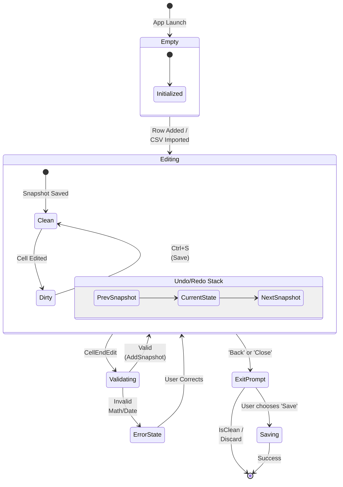
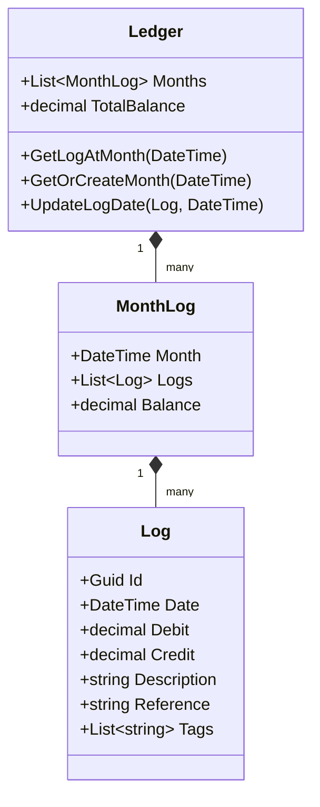
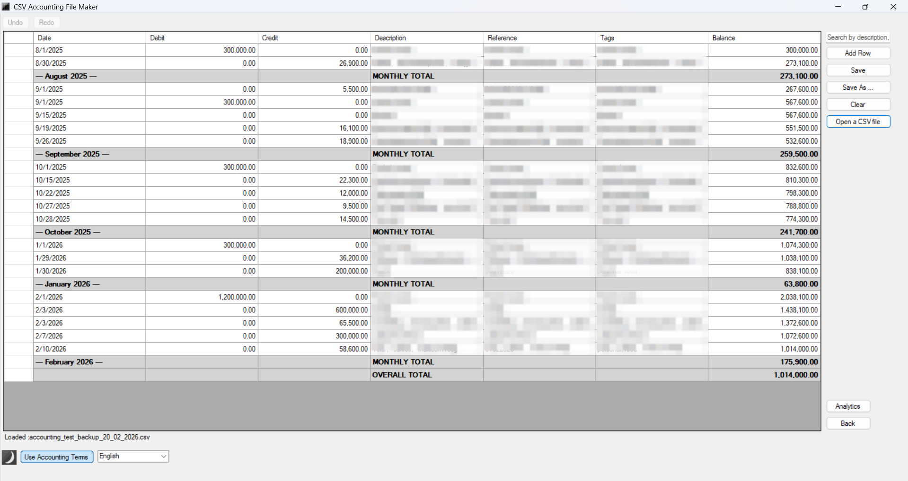

# simple-ledger-win
A lightweight personal finance tracker for rapid expense logging.

# Background
Financial is very important to be maintained, especially for college student. Back then at 2023, when I was learning finite state machine automata, I got inspiration to make financial expense tracker. So I decided to make simple ledger maker stored in CSV with these states.
State : 
    1. Menu,
    2. Add file,
    3. Edit file,
    4. Open file,
    5. Render ledger.

## Features
- CSV-based ledger storage
- Monthly balance grouping
- Tag filtering
- Descriptive statistics

## Architecture
```mermaid
graph TB
    subgraph Presentation_Layer ["Presentation Layer (UI)"]
        F1[Form1]
        subgraph User_Controls ["User Controls"]
            Menu[UCMainMenu]
            LedgerUI[UCLedger]
            AnalUI[UCAnalytics]
            About[UCAbout]
        end
        IPage <<interface>>
    end

    subgraph View_Model_Layer ["View Model Layer"]
        LRVM[LedgerRowViewModel]
        AVM[AnalyticsViewModel]
    end

    subgraph Service_Layer ["Service Layer"]
        CSV[CsvService]
        UR[UndoRedoService]
        Query[LedgerQueryService]
        Stats[LedgerAnalyticsService]
    end

    subgraph Domain_Layer ["Domain Layer (Data Model)"]
        Dom[Ledger]
        Month[MonthLog]
        Log[Log]
        Result[StatisticsResult]
    end

    subgraph Cross_Cutting ["Cross-Cutting"]
        State[LedgerState]
        Res["Resources (i18n)"]
    end

    %% Relations
    F1 -.-> IPage
    Menu --|> IPage
    LedgerUI --|> IPage
    AnalUI --|> IPage
    About --|> IPage

    LedgerUI -.-> LRVM
    AnalUI -.-> AVM

    LedgerUI --> CSV
    LedgerUI --> UR
    LedgerUI --> Query
    AnalUI --> Stats

    CSV -.-> Dom
    UR -.-> Dom
    Stats -.-> Dom
    Stats -.-> Result

    Dom *-- Month
    Month *-- Log

    State <.. F1
    State <.. Menu
    State <.. LedgerUI
    Res <.. F1
```

## State Flow


## Domain Model


## Example UI
<p align="center">
  
</p>
