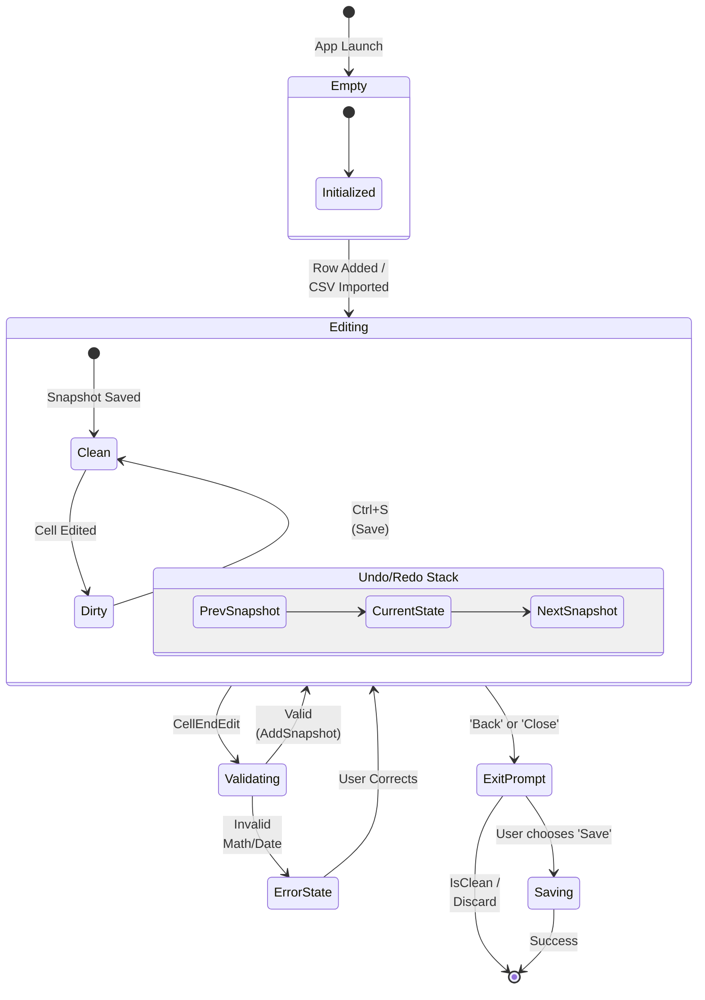
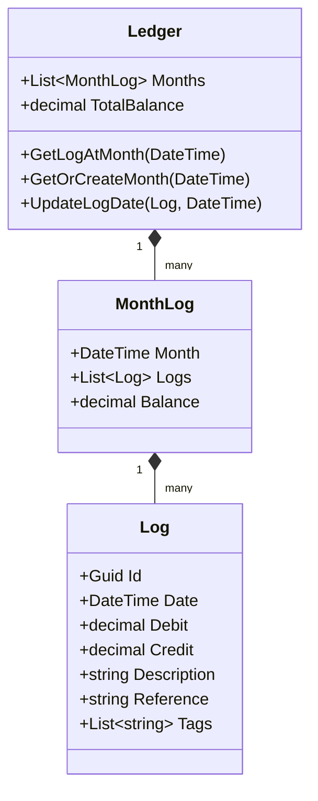

# simple-ledger-win
A lightweight personal finance tracker for rapid expense logging.

# Background
Financial is very important to be maintained, especially for college student. Back then at 2023, when I was learning finite state machine automata, I got inspiration to make financial expense tracker. So I decided to make simple ledger maker stored in CSV with these states.
State : 
    1. Menu,
    2. Add file,
    3. Edit file,
    4. Open file,
    5. Render ledger.

## Features
- CSV-based ledger storage
- Monthly balance grouping
- Tag filtering
- Descriptive statistics

## State Flow

## Domain Model

## Example UI

  

